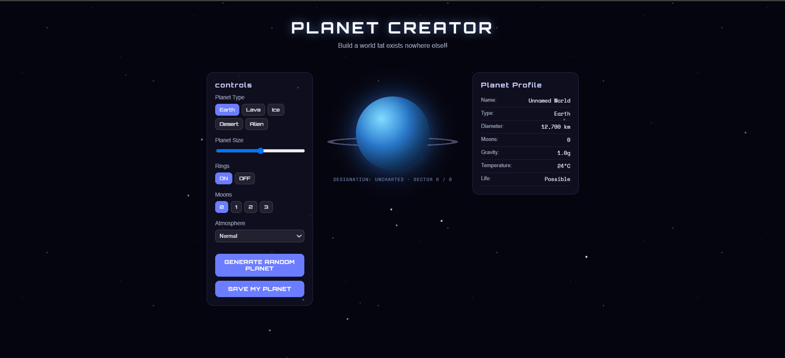

# Planet Creator

## Overview

Planet Creator is a simple interactive website that lets users create and customize their own planet.

You can choose the planet type, size, rings, number of moons, and atmosphere. You can also generate a random planet with a random name and coordinates. The website shows information about the planet, such as its diameter, gravity, temperature, and possible life.

    

## Languages Used

* HTML
* CSS
* JavaScript
